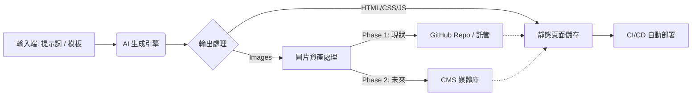

# 簡報：AI 驅動靜態網站生成與自動化部署系統規格書

---

## 1. 專案願景與目標 (Project Vision)

### 核心目標
建立一套標準化流程，利用 AI 快速量產靜態網頁，並具備將內容轉換為 CMS 格式的能力，最終實現自動化部署。

### 關鍵策略
1. **AI 生成**：利用 Gemini/Cursor 進行 Prompt 或 Template 生成。
2. **資產分離**：圖片與程式碼分離，支援從 GitHub 過渡到 CMS。
3. **混合架構**：目前以靜態託管為主，未來支援 CMS 自架。

### 專案規模 [請填入]
- **預計產出網站數量**：[例如：10 個站]
- **使用的 AI 工具**：[例如：Gemini 1.5 Pro, Cursor]

---

## 2. 系統核心流程 (System Architecture)



### 流程說明
1. **輸入**：定義 Prompt 或 Template。
2. **生成**：AI 產出原始碼。
3. **分流**：程式碼歸程式碼，圖片歸圖片（關鍵路徑）。
4. **部署**：透過自動化腳本上線。

---

## 3. 網頁生成策略 (Generation Strategy)

### 模式 A：Prompt-to-Site (純生成)
- **邏輯**：一句話生成全站。
- **輸入 (Input)**：[請填入您的標準 Prompt 結構，例如 "主題 + 配色 + 版型"]
- **輸出 (Output)**：完整的 `index.html`, `style.css`。

### 模式 B：Template-Based (模板填充)
- **邏輯**：固定版型，填充內容。
- **輸入 (Input)**：[請填入模板變數，例如 {{Title}}, {{Content}}, {{MainImg}}]
- **輸出 (Output)**：保留結構，僅替換文字與圖片連結。

> **給工程師的重點**：需開發一個 Parser 能識別兩種模式的產出，並進行標準化排版。

---

## 4. 關鍵技術點：圖片託管與路徑 (Asset Management)

### ❌ 禁止事項
- 禁止 Hardcode 圖片路徑 (如 ``)。

### ✅ 必要規格
- 必須使用 **環境變數 (Environment Variable)** 或 **Config 檔** 控制 Base URL。

### 程式碼範例
```javascript
// config.js
const CONFIG = {
    // Phase 1: GitHub Raw URL
    // IMG_BASE_URL: "https://raw.githubusercontent.com/user/repo/main/assets"
    
    // Phase 2: CMS API / CDN
    IMG_BASE_URL: "https://cms.yourdomain.com/uploads"
};

// 使用方式
img.src = `${CONFIG.IMG_BASE_URL}/header-bg.jpg`;
```

### 資料填寫 [請填入]
- **目前圖片儲存庫網址**：[例如：github.com/my-org/assets-repo]
- **圖片命名規則**：[例如：site-id_date_filename.jpg]

---

## 5. 未來擴充性：靜態轉 CMS (Data Structure)

為了未來能匯入 CMS，AI 生成的 HTML 需能被解析為以下 JSON 結構：

### JSON Schema 定義
```json
{
  "meta": {
    "title": "頁面標題",
    "description": "SEO 描述",
    "keywords": ["tag1", "tag2"]
  },
  "content": {
    "body_html": "<div>...</div>",
    "summary": "摘要文字"
  },
  "assets": [
    {
      "type": "image",
      "original_name": "hero.jpg",
      "usage": "header_background"
    }
  ]
}
```

### 未來規劃 [請填入]
- **預計使用的 CMS**：[例如：WordPress Headless, Strapi, 或尚未決定]

---

## 6. 部署與基礎設施 (Deployment)

### Phase 1: 靜態託管 (目前)
- **平台**：[請填入：Vercel / Netlify / GitHub Pages]
- **觸發方式**：Git Push -> CI/CD Build -> Deploy

### Phase 2: 自架 / CMS (未來)
- **平台**：自架伺服器 (CMS + Frontend)
- **要求**：產出需包含 `Dockerfile` 或標準化 Build Script，方便未來遷移。

---

## 7. 驗收標準 (Acceptance Criteria)

1. ✅ **生成工具**：輸入 Prompt 能產出符合結構的 HTML。
2. ✅ **配置化路徑**：更改 Config 檔的 `IMG_BASE_URL`，全站圖片路徑自動更新，無死連結。
3. ✅ **資料清洗腳本**：能將 HTML 轉換為上述定義的 JSON 格式。
4. ✅ **部署文件**：一份 `README.md` 說明如何新增一個新網站。

### 專案資訊 [請填入]
- **預計時程**：[例如：2週開發，1週測試]
- **聯絡人**：[您的名字]

