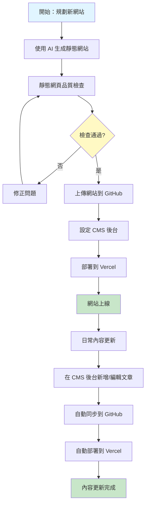
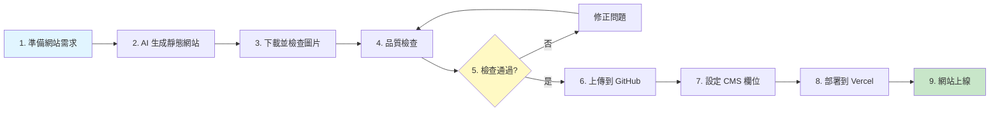
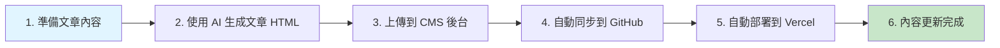
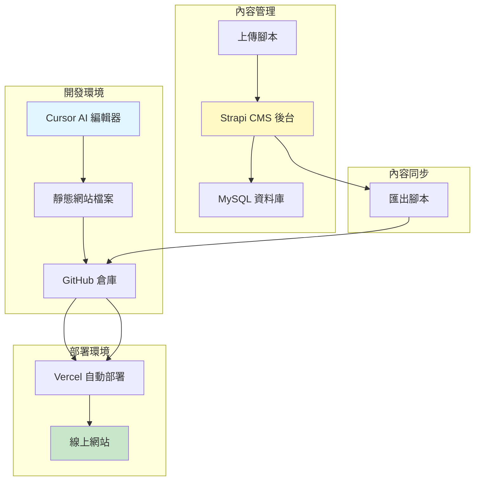
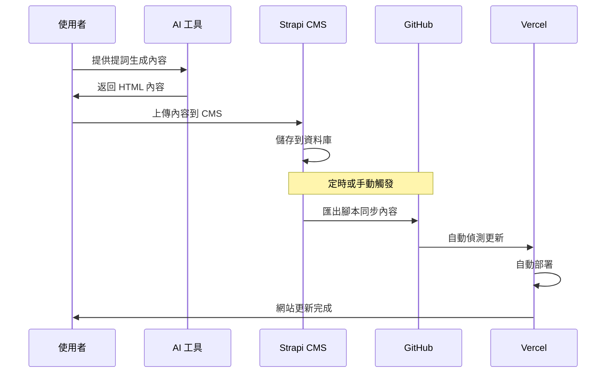
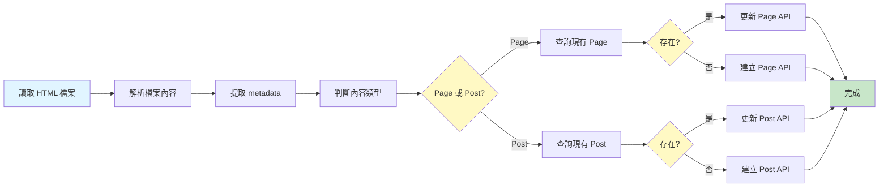
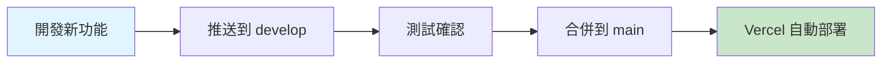
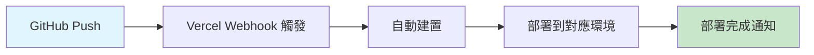
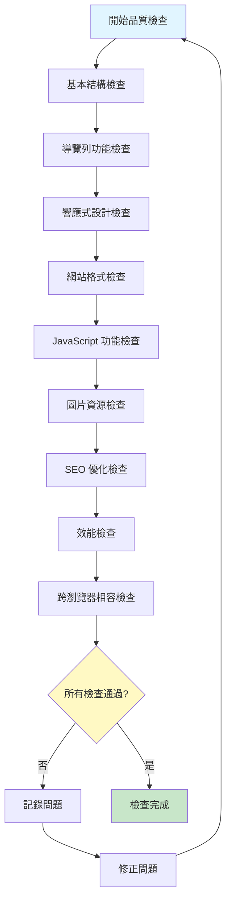
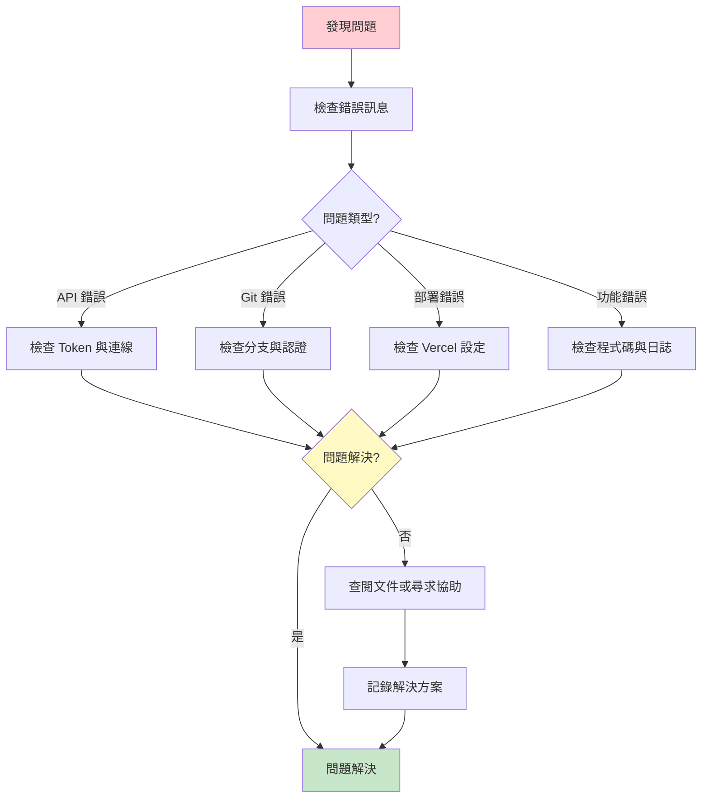

# 百站引流系統流程圖

本文檔包含系統的各種流程圖，使用 Mermaid 格式繪製。

---

## 1. 整體工作流程

---

## 2. 新網站建立流程

---

## 3. 日常內容更新流程

---

## 4. 系統架構圖

---

## 5. 資料流程圖

---

## 6. 內容上傳流程（詳細）

---

## 7. Git 工作流程

---

## 8. Vercel 自動部署流程

---

## 9. 品質檢查流程

---

## 10. 故障排除流程

---

## 使用說明

以上流程圖使用 Mermaid 格式繪製，可在以下環境中查看：

1. **GitHub**：直接在 Markdown 檔案中顯示
2. **VS Code**：安裝 Mermaid 擴充功能
3. **線上工具**：https://mermaid.live/

如需修改流程圖，請編輯對應的 Mermaid 程式碼。

---

**文件結束**

