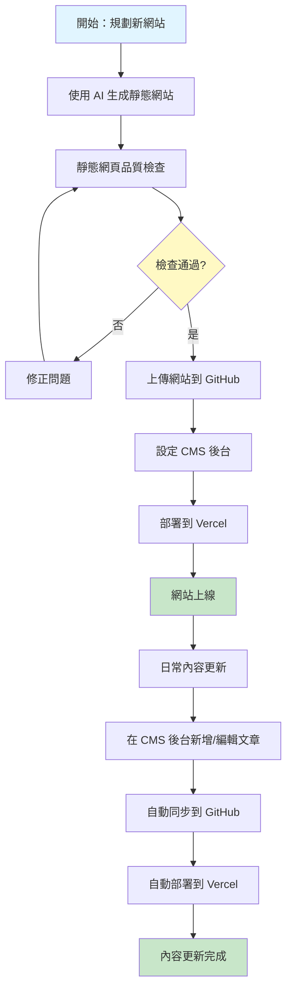
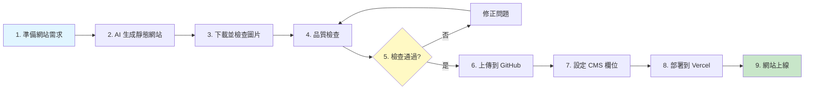
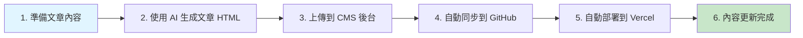
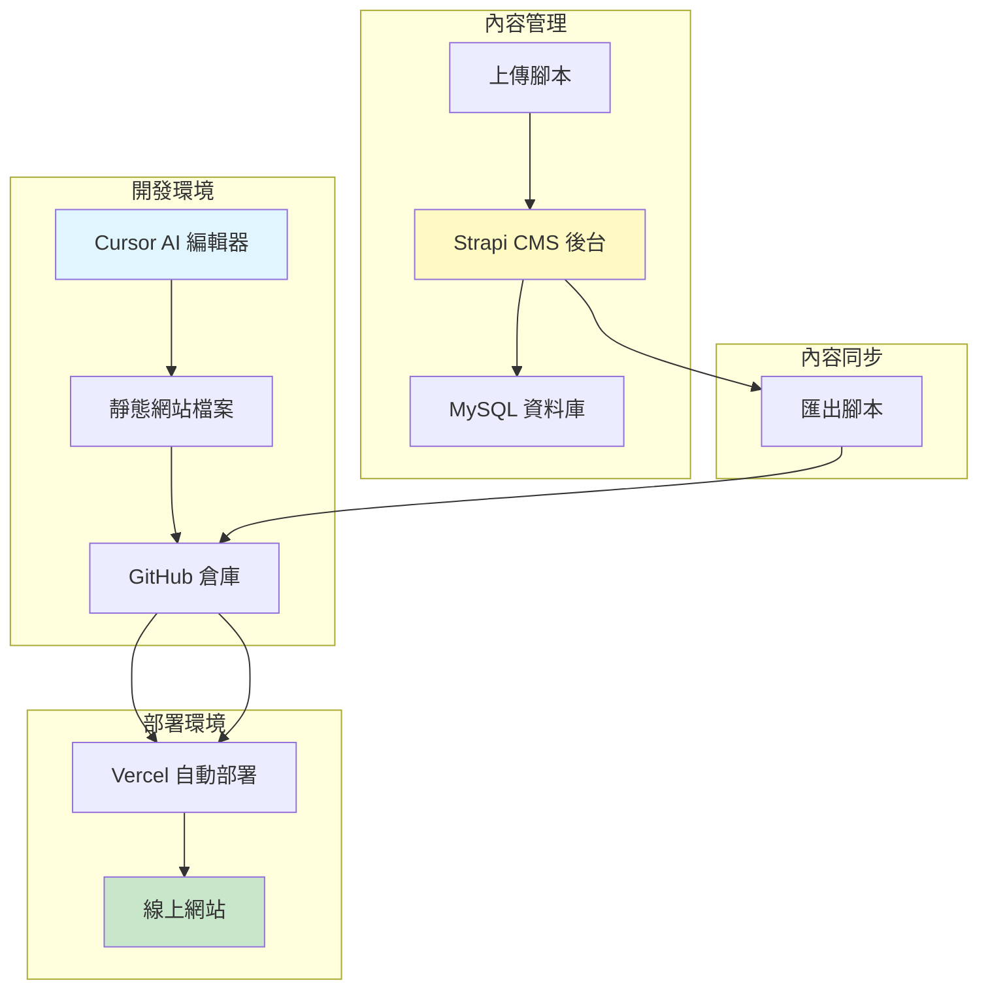
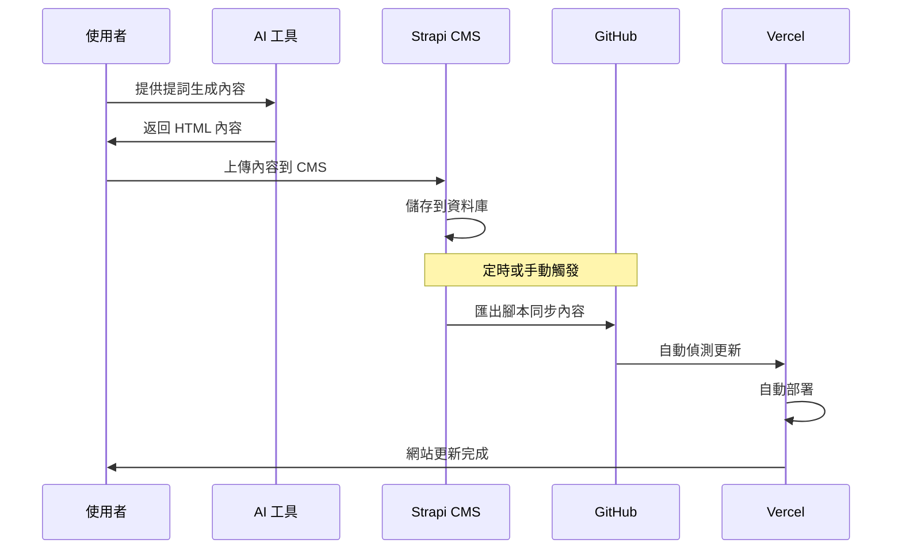
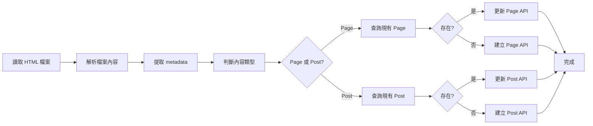
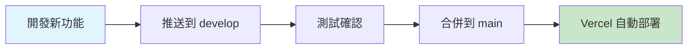
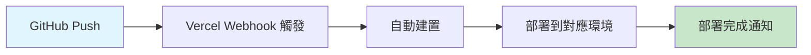

# 百站引流企劃規格書

**版本：** 2.0  
**更新日期：** 2025-01-XX  
**適用對象：** 企劃人員、非技術人員、程式開發人員

---

## 📋 目錄

### 第一部分：企劃與非技術人員指南
1. [專案概述](#專案概述)
2. [系統架構總覽](#系統架構總覽)
3. [工作流程圖](#工作流程圖)
4. [日常操作指南](#日常操作指南)
5. [靜態網頁品質檢查](#靜態網頁品質檢查)

### 第二部分：程式開發人員指南
6. [技術架構詳述](#技術架構詳述)
7. [開發環境設定](#開發環境設定)
8. [核心功能實作](#核心功能實作)
9. [部署流程詳述](#部署流程詳述)
10. [故障排除](#故障排除)

### 附錄
- [補充資料：進階功能](#補充資料進階功能)
- [相關連結與資源](#相關連結與資源)

---

# 第一部分：企劃與非技術人員指南

## 1. 專案概述

### 1.1 專案目標

本專案旨在建立一套**高效的多站點內容管理與部署系統**，透過以下方式實現：

- ✅ **AI 輔助生成**：使用 AI 工具自動生成靜態網站與文章內容
- ✅ **集中管理**：透過 CMS 後台統一管理多個網站的內容
- ✅ **自動化部署**：內容更新後自動同步到 GitHub 並部署到雲端
- ✅ **品質控制**：建立標準化的檢查流程，確保網站品質

### 1.2 系統核心價值

1. **提升效率**：減少重複性工作，自動化內容生成與部署流程
2. **統一管理**：所有網站內容集中在一個後台管理，降低維護成本
3. **擴展性強**：可輕鬆新增新網站，支援百站規模的內容管理
4. **成本控制**：採用自託管 CMS 方案，避免流量帶來的 API 呼叫費用

### 1.3 適用對象

- **企劃人員**：了解整體流程，規劃內容策略
- **內容編輯**：使用 CMS 後台更新文章內容
- **專案管理**：掌握專案進度與品質檢查流程

---

## 2. 系統架構總覽

### 2.1 系統組成

本系統由以下四個主要部分組成：

```
┌─────────────────┐
│   內容生成層     │  AI 生成文章與網站
├─────────────────┤
│   內容管理層     │  Strapi CMS 後台
├─────────────────┤
│   版本控制層     │  GitHub 倉庫
├─────────────────┤
│   部署發布層     │  Vercel 雲端託管
└─────────────────┘
```

### 2.2 各層級功能說明

| 層級 | 功能 | 負責人員 |
|------|------|----------|
| **內容生成層** | 使用 AI 工具生成靜態網站與文章 | 企劃/內容編輯 |
| **內容管理層** | 集中管理所有網站內容，提供編輯介面 | 內容編輯 |
| **版本控制層** | 儲存所有程式碼與內容，記錄變更歷史 | 程式開發 |
| **部署發布層** | 自動將更新內容發布到線上環境 | 自動化流程 |

---

## 3. 工作流程圖

### 3.1 整體工作流程



### 3.2 新網站建立流程



### 3.3 日常內容更新流程



---

## 4. 日常操作指南

### 4.1 新增文章操作步驟

#### 步驟一：準備文章提詞

1. 開啟文章提詞範本檔案：`下載/新增文章提詞(Gemini).txt`
2. 修改以下內容：
   - **文章日期**：改為要新增的日期（格式：YYYY-MM-DD）
   - **網站名稱**：指定要新增文章的網站
   - **文章主題**：描述文章內容主題

#### 步驟二：使用 AI 生成文章

1. 前往 [Google Gemini](https://gemini.google.com/)
2. 將修改後的提詞複製貼上
3. 等待 AI 生成文章 HTML 內容
4. 複製生成的 HTML 內容

#### 步驟三：上傳到 CMS 後台

**方式一：透過 CMS 後台手動新增（推薦給非技術人員）**

1. 登入 Strapi CMS 後台
2. 點擊左側選單「Content Manager」→「Post」
3. 點擊右上角「Create new entry」
4. 填寫以下欄位：
   - **site**：網站名稱（例如：星宿探索家sce010）
   - **slug**：文章網址（例如：2025-01-15）
   - **title**：文章標題
   - **category**：文章類別（daily 或 fixed）
   - **html**：貼上生成的 HTML 內容
   - **date**：文章日期（格式：YYYY-MM-DD）
5. 點擊右上角「Save」儲存

**方式二：使用上傳腳本（適合批量上傳）**

1. 將 HTML 檔案儲存到對應網站的 `articles` 資料夾
2. 開啟命令提示字元
3. 執行上傳腳本：
   ```bash
   node 通用上傳腳本.cjs [網站資料夾名稱]
   ```
   例如：`node 通用上傳腳本.cjs 星宿探索家sce010`

#### 步驟四：確認更新

1. 等待 1-2 分鐘（自動同步與部署時間）
2. 前往網站查看新文章是否已顯示
3. 如未顯示，檢查 CMS 後台是否有錯誤訊息

### 4.2 新增網站操作步驟

#### 步驟一：使用 AI 生成靜態網站

1. 開啟 Cursor 編輯器
2. 使用 Cursor Composer 功能
3. 參考提詞範本：`cursor AI生成靜態網頁提詞範本.txt`
4. 提供以下資訊給 AI：
   - 網站主題
   - 網站風格
   - 功能需求
5. 等待 AI 生成完整的靜態網站程式碼

#### 步驟二：準備網站圖片

1. 前往 [GitHub 規格書倉庫](https://github.com/test100web/Specification-Document.git)
2. 下載「AI抓取無版權圖(Pexels)」資料夾
3. 閱讀「注意事項(抓取前閱讀).txt」，修改 Pexels API Key
4. 執行「圖片下載.bat」，選擇圖片清單檔案
5. 圖片會下載到 `downloaded_images` 資料夾

#### 步驟三：品質檢查

請參考「[5. 靜態網頁品質檢查](#5-靜態網頁品質檢查)」章節，完成所有檢查項目。

#### 步驟四：上傳到 GitHub

1. 將網站資料夾複製到 GitHub 專案根目錄
2. 開啟命令提示字元，切換到專案目錄
3. 執行以下指令：
   ```bash
   git add .
   git commit -m "feat: 新增網站 [網站名稱]"
   git push origin develop
   ```

#### 步驟五：設定 CMS 後台

1. 登入 Strapi CMS 後台
2. 使用「通用上傳腳本」將網站內容上傳到 CMS：
   ```bash
   node 通用上傳腳本.cjs [網站資料夾名稱]
   ```

#### 步驟六：部署到 Vercel

1. 登入 Vercel 後台
2. 系統會自動偵測 GitHub 的更新
3. 等待自動部署完成（約 1-2 分鐘）
4. 檢查部署狀態，確認網站已上線

---

## 5. 靜態網頁品質檢查

### 5.1 檢查項目總表

請在完成每個檢查項目後，在「✓」欄位打勾確認。

| 檢查類別 | 檢查項目 | 檢查方式 | 通過標準 | ✓ |
|---------|---------|---------|---------|---|
| **基本結構** | HTML 檔案完整性 | 開啟所有 HTML 檔案 | 所有檔案可正常開啟，無錯誤訊息 | ☐ |
| | 檔案命名規範 | 檢查檔案名稱 | 符合命名規範（小寫、連字號分隔） | ☐ |
| | 資料夾結構 | 檢查資料夾組織 | 符合標準結構（css、js、articles 等） | ☐ |
| **導覽列功能** | 導覽列顯示 | 開啟網站首頁 | 導覽列正常顯示，無重疊或錯位 | ☐ |
| | 導覽列收合功能 | 點擊導覽列按鈕 | 點擊後才下拉，不會自動展開 | ☐ |
| | 導覽列關閉功能 | 點擊 X 按鈕 | 點擊後導覽列正確關閉 | ☐ |
| | 固定文章導覽 | 點擊固定文章選單 | 點擊後可正常下拉顯示選單 | ☐ |
| **響應式設計** | 手機版顯示 | 使用瀏覽器開發者工具切換手機版 | 版面正常，無元素重疊或超出螢幕 | ☐ |
| | 平板版顯示 | 切換到平板尺寸 | 版面正常，元素排列合理 | ☐ |
| | 桌面版顯示 | 切換到桌面尺寸 | 版面正常，內容居中對齊 | ☐ |
| | 響應式導覽列 | 在不同尺寸測試導覽列 | 導覽列在所有尺寸下正常運作 | ☐ |
| **網站格式** | 文字顯示 | 檢查所有頁面文字 | 文字清晰可讀，無被按鈕或元素遮擋 | ☐ |
| | 按鈕功能 | 點擊所有按鈕 | 按鈕點擊後執行正確功能 | ☐ |
| | 連結功能 | 點擊所有連結 | 連結可正常跳轉到目標頁面 | ☐ |
| **JavaScript 動態功能** | 首頁文章切換 | 點擊首頁文章切換按鈕 | 可正常切換到下一張卡片 | ☐ |
| | 動態內容載入 | 檢查動態載入的內容 | 內容可正常載入並顯示 | ☐ |
| | 互動功能 | 測試所有互動元素 | 所有互動功能正常運作 | ☐ |
| **圖片資源** | 圖片完整性 | 檢查所有圖片 | 所有圖片可正常顯示，無破圖 | ☐ |
| | 圖片路徑 | 檢查圖片路徑 | 圖片路徑正確，使用相對路徑或 CDN | ☐ |
| | 圖片優化 | 檢查圖片大小 | 圖片已優化，載入速度合理 | ☐ |
| **SEO 優化** | Meta 標籤 | 檢查 HTML head 區塊 | 包含 title、description、keywords | ☐ |
| | 語義化標籤 | 檢查 HTML 結構 | 使用適當的 HTML5 語義標籤 | ☐ |
| | 結構化資料 | 檢查 JSON-LD | 包含適當的結構化資料 | ☐ |
| **效能檢查** | 頁面載入速度 | 使用瀏覽器開發者工具 | 頁面載入時間 < 3 秒 | ☐ |
| | 資源載入 | 檢查 Network 面板 | 無 404 錯誤，資源正常載入 | ☐ |
| | 控制台錯誤 | 檢查 Console 面板 | 無 JavaScript 錯誤訊息 | ☐ |
| **跨瀏覽器相容** | Chrome 瀏覽器 | 在 Chrome 中開啟 | 網站正常顯示與運作 | ☐ |
| | Firefox 瀏覽器 | 在 Firefox 中開啟 | 網站正常顯示與運作 | ☐ |
| | Edge 瀏覽器 | 在 Edge 中開啟 | 網站正常顯示與運作 | ☐ |
| | Safari 瀏覽器 | 在 Safari 中開啟（如可取得） | 網站正常顯示與運作 | ☐ |

### 5.2 常見問題與解決方式

#### 問題 1：導覽列自動展開

**現象**：進入網站時，導覽列自動下拉展開

**解決方式**：
1. 開啟 Cursor 編輯器
2. 使用 Cursor Composer 功能
3. 提供提詞：`[網站資料夾位置]，請讓導覽列收回，點擊才會下拉，進入網站不要馬上下拉`

#### 問題 2：響應式導覽列無法下拉

**現象**：在手機版點擊固定文章選單，無法下拉顯示

**解決方式**：
1. 使用 Cursor Composer
2. 提供提詞：`[網站資料夾位置]，響應式的固定文章導覽列，點擊沒有下拉固定文章，請修正`

#### 問題 3：導覽列關閉按鈕無效

**現象**：點擊 X 按鈕後，導覽列未關閉

**解決方式**：
1. 使用 Cursor Composer
2. 提供提詞：`[網站資料夾位置]，導覽列點擊 X 按鈕未關閉，點擊按鈕關閉`

#### 問題 4：文字被按鈕遮擋

**現象**：頁面上的文字被按鈕或其他元素遮擋

**解決方式**：
1. 使用 Cursor Composer
2. 提供提詞：`[網站資料夾位置]，文字被按鈕遮擋到了（[具體描述]），請不要讓文字被蓋住`

#### 問題 5：首頁文章切換按鈕無效

**現象**：點擊首頁文章切換按鈕，無法切換到下一張卡片

**解決方式**：
1. 使用 Cursor Composer
2. 提供提詞：`[網站資料夾位置]，首頁文章按鈕點擊未切換到下一張卡片，請修改`

### 5.3 檢查完成確認

完成所有檢查項目後，請確認：

- [ ] 所有必檢項目（標記為「必檢」）均已通過
- [ ] 所有問題均已修正
- [ ] 網站可在多個瀏覽器中正常運作
- [ ] 網站響應式設計在各尺寸下正常顯示
- [ ] 無 JavaScript 錯誤或控制台警告

**檢查人員簽名：** _______________  
**檢查日期：** _______________

---

# 第二部分：程式開發人員指南

## 6. 技術架構詳述

### 6.1 系統技術棧

| 層級 | 技術 | 版本/說明 |
|------|------|----------|
| **前端** | HTML5 / CSS3 / JavaScript | 靜態網站，無框架 |
| **內容管理** | Strapi CMS | 自託管版本（未來規劃） |
| **資料庫** | MySQL | 自託管環境使用 |
| **版本控制** | Git / GitHub | 主分支：main，開發分支：develop |
| **部署平台** | Vercel | 自動部署 |
| **AI 工具** | Google Gemini API | 文章生成 |
| **自動化工具** | Node.js 腳本 | 內容同步與部署 |

### 6.2 系統架構圖



### 6.3 資料流程



---

## 7. 開發環境設定

### 7.1 必要工具安裝

#### Node.js 環境

1. 下載並安裝 [Node.js](https://nodejs.org/)（建議版本 18+）
2. 驗證安裝：
   ```bash
   node --version
   npm --version
   ```

#### Git 版本控制

1. 下載並安裝 [Git for Windows](https://git-scm.com/download/win)
2. 設定 Git 使用者資訊：
   ```bash
   git config --global user.email "your-email@example.com"
   git config --global user.name "Your Name"
   ```

#### Cursor 編輯器

1. 下載並安裝 [Cursor](https://cursor.sh/)
2. 安裝 Cursor Composer 擴充功能（如需要）

### 7.2 專案初始化

#### 步驟一：克隆 GitHub 倉庫

```bash
git clone https://github.com/test100web/100-website.git
cd 100-website
```

#### 步驟二：安裝專案依賴

```bash
npm install
```

#### 步驟三：設定環境變數

建立 `.env` 檔案（如不存在）：

```env
# Strapi CMS 設定
STRAPI_URL=http://localhost:1337
STRAPI_TOKEN=your-strapi-token

# Google Gemini API
GEMINI_API_KEY=your-gemini-api-key

# GitHub 設定
GITHUB_REPO_PATH=C:\path\to\100-website
GITHUB_AUTO_PUSH=true
```

### 7.3 Strapi CMS 設定

#### 目前狀態：雲端託管

目前使用 Strapi Cloud 雲端託管方案：
- **優點**：無需維護伺服器，快速上線
- **缺點**：有 API 呼叫次數限制，流量大時費用較高

#### 未來規劃：自託管

**為什麼要改成自託管？**

1. **成本考量**：
   - 雲端託管：每次 API 呼叫都計費，流量大時費用昂貴
   - 自託管：只需伺服器費用，無 API 呼叫限制

2. **擴展性**：
   - 支援百站規模，每日更新 2-3 篇文章
   - 預估 API 呼叫次數：100 站 × 3 篇/天 × 30 天 = 9,000 次/月（僅文章更新）
   - 加上網站瀏覽的 API 呼叫，雲端方案成本會很高

3. **技術架構**：
   - 使用 MySQL 資料庫（無額外費用）
   - 伺服器可自行選擇規格與供應商

**建議時機**：

- ✅ **現在不改**：目前尚未實際使用伺服器，且流量規模還不大
- ✅ **未來必改**：當網站數量達到 50+ 或流量明顯增加時，建議切換到自託管
- ✅ **準備工作**：可以先準備自託管環境的設定文件，待時機成熟時快速切換

#### Strapi 欄位結構

**Page 內容類型**：

| 欄位名稱 | 類型 | 說明 | 必填 |
|---------|------|------|------|
| site | Short Text | 網站名稱 | ✓ |
| type | Enumeration | 頁面類型（home, about, contact, privacy） | ✓ |
| slug | Short Text | 頁面網址 | ✓ |
| title | Short Text | 頁面標題 | ✓ |
| html | Long Text | HTML 內容 | ✓ |
| imageUrl | Short Text | 圖片網址 | - |
| ad | Short Text | 廣告資訊（JSON 格式） | - |

**Post 內容類型**：

| 欄位名稱 | 類型 | 說明 | 必填 |
|---------|------|------|------|
| site | Short Text | 網站名稱 | ✓ |
| slug | Short Text | 文章網址 | ✓ |
| title | Short Text | 文章標題 | ✓ |
| category | Short Text | 文章類別（daily, fixed） | ✓ |
| html | Long Text | HTML 內容 | ✓ |
| excerpt | Short Text | 文章摘要 | - |
| date | Short Text | 文章日期（YYYY-MM-DD） | ✓ |
| imageUrl | Short Text | 圖片網址 | - |
| isFeatured | Boolean | 是否為精選文章 | - |
| ad | Short Text | 廣告資訊（JSON 格式） | - |

---

## 8. 核心功能實作

### 8.1 靜態網站生成流程

#### 8.1.1 使用 Cursor Composer 生成

**操作步驟**：

1. 開啟 Cursor 編輯器
2. 建立新資料夾作為網站根目錄
3. 使用 Cursor Composer（快捷鍵：`Ctrl+I`）
4. 提供提詞，參考範本：`cursor AI生成靜態網頁提詞範本.txt`

**提詞範例**：

```
請為我建立一個關於「星座運勢」的靜態網站，包含以下功能：
1. 首頁：顯示最新文章列表
2. 關於我們頁面
3. 聯絡我們頁面
4. 隱私權政策頁面
5. 響應式設計，支援手機、平板、桌面
6. 導覽列可收合，點擊後才展開
7. 使用現代化的設計風格，配色為深藍色系
```

**生成結果**：

AI 會生成完整的網站結構：
```
網站資料夾/
├── index.html          # 首頁
├── about.html          # 關於我們
├── contact.html        # 聯絡我們
├── privacy.html        # 隱私權政策
├── css/
│   └── style.css       # 樣式表
├── js/
│   └── main.js         # JavaScript
└── articles/           # 文章資料夾（可選）
```

#### 8.1.2 網站結構標準化

所有生成的網站應符合以下結構：

```
[網站名稱]/
├── index.html              # 首頁（必備）
├── about.html              # 關於我們（必備）
├── contact.html            # 聯絡我們（必備）
├── privacy.html            # 隱私權政策（必備）
├── all-daily-articles.html # 所有每日文章列表（可選）
├── css/
│   └── style.css          # 主要樣式表
├── js/
│   └── main.js            # 主要 JavaScript
├── articles/               # 每日文章資料夾
│   └── YYYY-MM-DD.html    # 文章檔案（日期格式）
└── fixed-articles/        # 固定文章資料夾（可選）
    └── [文章名稱].html
```

### 8.2 內容上傳流程

#### 8.2.1 上傳腳本功能說明

**檔案位置**：`通用上傳腳本.cjs`

**功能**：
1. 讀取指定網站資料夾的所有 HTML 檔案
2. 自動判斷檔案類型（Page 或 Post）
3. 提取檔案內容與 metadata
4. 呼叫 Strapi API 建立或更新內容
5. 自動注入 CMS 腳本（如需要）

**使用方式**：

```bash
node 通用上傳腳本.cjs [網站資料夾名稱] [環境]
```

**參數說明**：
- `網站資料夾名稱`：例如 `星宿探索家sce010` 或 `sce010`
- `環境`：`production`（預設）或 `development`

**範例**：

```bash
# 上傳單一網站到正式環境
node 通用上傳腳本.cjs 星宿探索家sce010 production

# 上傳單一網站到開發環境
node 通用上傳腳本.cjs sce010 development
```

#### 8.2.2 檔案類型判斷邏輯

腳本會根據檔案路徑和內容自動判斷：

| 檔案路徑 | 判斷結果 | 處理方式 |
|---------|---------|---------|
| `index.html` | Page (type: home) | 上傳到 Page 內容類型 |
| `about.html` | Page (type: about) | 上傳到 Page 內容類型 |
| `contact.html` | Page (type: contact) | 上傳到 Page 內容類型 |
| `privacy.html` | Page (type: privacy) | 上傳到 Page 內容類型 |
| `articles/*.html` | Post (category: daily) | 上傳到 Post 內容類型 |
| `fixed-articles/*.html` | Post (category: fixed) | 上傳到 Post 內容類型 |

#### 8.2.3 API 呼叫流程



### 8.3 內容匯出與同步流程

#### 8.3.1 匯出腳本功能說明

**檔案位置**：`export-strapi-to-github.cjs`

**功能**：
1. 從 Strapi CMS 抓取指定站點的文章
2. 根據文章內容生成 HTML 檔案
3. 將檔案寫入對應的網站資料夾
4. 自動執行 Git commit 和 push

**使用方式**：

```bash
node export-strapi-to-github.cjs [站點] [日期] [類別]
```

**參數說明**：
- `站點`：網站名稱（例如：`星宿探索家sce010`）或 `all`（所有站點）
- `日期`：文章日期（格式：YYYY-MM-DD），預設今天
- `類別`：`daily`、`fixed` 或 `all`，預設 `daily`

**範例**：

```bash
# 匯出單一站點今天的每日文章
node export-strapi-to-github.cjs sce010 2025-01-15 daily

# 匯出所有站點今天的每日文章
node export-strapi-to-github.cjs all 2025-01-15 daily

# 匯出所有類別的文章
node export-strapi-to-github.cjs all 2025-01-15 all
```

#### 8.3.2 Git 自動化流程

腳本會自動執行以下 Git 操作：

1. **檢查 Git 倉庫狀態**：
   ```bash
   git status
   ```

2. **加入變更檔案**：
   ```bash
   git add .
   ```

3. **提交變更**：
   ```bash
   git commit -m "feat: 更新 [站點名稱] 文章 - [日期]"
   ```

4. **推送到 GitHub**：
   ```bash
   git push origin develop
   ```

**注意事項**：
- 預設推送到 `develop` 分支
- 如需推送到 `main` 分支，需手動切換：
  ```bash
  git checkout main
  git merge develop
  git push origin main
  ```

### 8.4 AI 文章生成流程

#### 8.4.1 文章生成腳本

**檔案位置**：`ai-generate-articles.cjs`

**功能**：
1. 讀取提詞檔案
2. 呼叫 Google Gemini API 生成文章
3. 將生成的文章上傳到 Strapi CMS
4. 支援批量生成多個站點的文章

**使用方式**：

```bash
node ai-generate-articles.cjs [站點] [日期] [數量] [類別]
```

**環境變數設定**：

```bash
# Windows PowerShell
$env:SITES="sce010,site1,cds006"
$env:DATE="2025-01-15"
$env:COUNT="1"
$env:CATEGORY="daily"
$env:STRAPI_URL="http://localhost:1337"
$env:STRAPI_TOKEN="your-token"
$env:GEMINI_API_KEY="your-api-key"
$env:PROMPT_FILE="下載/新增文章提詞.txt"

node ai-generate-articles.cjs
```

#### 8.4.2 提詞檔案格式

**檔案位置**：`下載/新增文章提詞(Gemini).txt`

**關鍵變數**：
- `[日期]`：替換為實際日期（YYYY-MM-DD）
- `[網站名稱]`：替換為目標網站名稱
- `[主題]`：替換為文章主題

**範例**：

```
請為「[網站名稱]」網站生成一篇關於「[主題]」的文章，日期為 [日期]。

要求：
1. 文章標題要吸引人
2. 內容約 800-1000 字
3. 使用 HTML 格式
4. 包含適當的標題層級（h2, h3）
5. 內容要有實用價值
```

---

## 9. 部署流程詳述

### 9.1 GitHub 倉庫管理

#### 9.1.1 分支策略

- **main 分支**：正式環境，用於生產部署
- **develop 分支**：開發環境，日常開發使用

#### 9.1.2 工作流程



#### 9.1.3 合併流程

**從 develop 合併到 main**：

```bash
# 1. 切換到 main 分支
git checkout main

# 2. 拉取最新內容
git pull origin main

# 3. 合併 develop 分支
git merge develop

# 4. 解決衝突（如有）
# 編輯衝突檔案，然後：
git add .
git commit -m "Merge: 合併 develop 到 main"

# 5. 推送到 GitHub
git push origin main
```

### 9.2 Vercel 自動部署

#### 9.2.1 首次設定

1. **連接 GitHub 帳號**：
   - 登入 [Vercel](https://vercel.com)
   - 點擊「Add New Project」
   - 選擇「Import Git Repository」
   - 授權 GitHub 存取

2. **選擇倉庫**：
   - 選擇 `test100web/100-website`
   - 點擊「Import」

3. **專案設定**：
   - **Framework Preset**：Other
   - **Root Directory**：`./`（保持預設）
   - **Build Command**：留空（靜態網站無需建置）
   - **Output Directory**：留空（使用根目錄）

4. **環境變數**（如需要）：
   - 在「Environment Variables」中新增必要的環境變數

5. **部署**：
   - 點擊「Deploy」
   - 等待部署完成

#### 9.2.2 環境設定

**建立開發環境**：

1. 前往專案「Settings」→「Environments」
2. 點擊「Create Environment」
3. 設定：
   - **Environment Name**：`develop`
   - **Branch Tracking**：`develop`
4. 點擊「Create」

**結果**：
- `main` 分支的更新 → 部署到正式環境
- `develop` 分支的更新 → 部署到開發環境

#### 9.2.3 自動部署流程



**觸發條件**：
- 推送到 `main` 分支 → 部署到正式環境
- 推送到 `develop` 分支 → 部署到開發環境

### 9.3 網站上線確認

#### 9.3.1 部署後檢查清單

- [ ] 網站可正常存取
- [ ] 所有頁面可正常開啟
- [ ] 圖片資源正常載入
- [ ] JavaScript 功能正常運作
- [ ] 響應式設計正常顯示
- [ ] 無 404 錯誤
- [ ] 無 JavaScript 錯誤（檢查 Console）

#### 9.3.2 外部環境瀏覽確認

**檢查步驟**：

1. **使用不同裝置測試**：
   - 桌面電腦（Chrome、Firefox、Edge）
   - 手機（iOS Safari、Android Chrome）
   - 平板（如可取得）

2. **使用不同網路測試**：
   - 公司網路
   - 家用網路
   - 行動網路（4G/5G）

3. **檢查項目**：
   - 網站載入速度
   - 所有連結可正常跳轉
   - 表單功能正常（如有）
   - 圖片載入正常
   - 響應式設計正常

4. **使用線上工具檢查**：
   - [Google PageSpeed Insights](https://pagespeed.web.dev/)
   - [GTmetrix](https://gtmetrix.com/)
   - [WebPageTest](https://www.webpagetest.org/)

#### 9.3.3 監控設定

**使用 UptimeRobot 監控網站**：

1. 註冊 [UptimeRobot](https://uptimerobot.com/) 帳號
2. 點擊「Monitoring」→「+ New Monitor」
3. 設定：
   - **Monitor Type**：HTTP(s)
   - **URL to monitor**：網站網址
   - **Monitoring Interval**：5 分鐘
4. 設定通知（如需要）：
   - 綁定 Telegram Bot
   - 設定 Email 通知

---

## 10. 故障排除

### 10.1 常見問題與解決方案

#### 問題 1：Strapi API 呼叫失敗

**錯誤訊息**：
```
❌ Strapi API 錯誤: 401 Unauthorized
```

**可能原因**：
- Token 過期或錯誤
- Strapi 服務未啟動

**解決方式**：
1. 檢查 `.env` 檔案中的 `STRAPI_TOKEN` 是否正確
2. 確認 Strapi 服務正在運行
3. 重新取得 Token（如需要）

#### 問題 2：Git Push 失敗

**錯誤訊息**：
```
error: failed to push some refs to 'origin'
```

**可能原因**：
- 遠端倉庫有新的 commit
- 認證失敗

**解決方式**：
1. 先拉取遠端變更：
   ```bash
   git pull origin develop
   ```
2. 解決衝突（如有）
3. 再次推送：
   ```bash
   git push origin develop
   ```

#### 問題 3：Vercel 部署失敗

**錯誤訊息**：
```
Build Failed
```

**可能原因**：
- 專案設定錯誤
- 檔案路徑問題

**解決方式**：
1. 檢查 Vercel 專案設定
2. 確認「Root Directory」設定正確
3. 檢查「Build Command」是否留空
4. 查看 Vercel 部署日誌找出具體錯誤

#### 問題 4：網站圖片無法顯示

**可能原因**：
- 圖片路徑錯誤
- 圖片未上傳到 GitHub

**解決方式**：
1. 檢查圖片路徑是否使用相對路徑或正確的 CDN 路徑
2. 確認圖片檔案已提交到 GitHub
3. 檢查圖片檔案名稱是否正確（大小寫敏感）

### 10.2 除錯技巧

#### 檢查腳本執行日誌

所有腳本都會輸出詳細的執行日誌，包括：
- ✅ 成功操作
- ⚠️ 警告訊息
- ❌ 錯誤訊息

**範例輸出**：
```
🚀 開始上傳 星宿探索家sce010 的文章到Strapi CMS

📄 處理檔案: index.html
   類型: Page
   標題: 星宿探索家
  ✅ 已注入 CMS 腳本
  ✅ 建立 Page: home

📄 處理檔案: articles/2025-01-15.html
   類型: Post
   標題: 今日運勢
  ✅ 建立 Post: 2025-01-15 (daily)

📊 上傳結果統計
Page: 建立 4 | 更新 0 | 失敗 0
Post: 建立 3 | 更新 0 | 失敗 0
```

#### 使用開發者工具檢查

1. **瀏覽器開發者工具**（F12）：
   - Console：檢查 JavaScript 錯誤
   - Network：檢查資源載入狀態
   - Elements：檢查 HTML 結構

2. **Git 狀態檢查**：
   ```bash
   git status
   git log --oneline -10
   ```

3. **Strapi 後台檢查**：
   - 登入 Strapi 後台
   - 檢查 Content Manager 中的內容
   - 查看 API Log（如有）

---

# 附錄

## 補充資料：進階功能

### A.1 同一網站生成不同 CSS 樣式

**適用情境**：
- 需要為同一網站建立多個視覺風格版本
- A/B 測試不同設計風格
- 建立主題變體

**操作步驟**：

1. 使用 Cursor Composer
2. 參考提詞範本：`一個網站生成多個樣式.txt`
3. 提供以下資訊：
   - 原始網站資料夾位置
   - 目標生成位置
   - 要修改的樣式元素（顏色、字體、佈局等）

**注意事項**：
- 此功能為選用功能，非必要
- 建議在確定網站基本結構後再使用
- 生成的樣式版本需要分別進行品質檢查

### A.2 圖片自動偵測與補齊

**功能說明**：
自動偵測網站中缺少的圖片，並從 Pexels 下載或使用 AI 生成補齊。

**操作步驟**：

1. 使用 Cursor Composer
2. 提供提詞：
   ```
   Github圖片位置替換為: [GitHub存放網站圖片位置]
   本機靜態網頁程式碼位置替換為: [存放靜態網頁位置]
   並提供缺少圖片的描述檔
   ```
3. 執行「一鍵檢測並下載.bat」
4. 檢查下載的圖片並確認路徑正確

### A.3 批量處理多個網站

**適用情境**：
- 需要同時更新多個網站
- 批量上傳新網站到 CMS

**操作方式**：

1. **批量上傳腳本**：
   ```bash
   node 批量上傳所有網站.cjs
   ```

2. **批量生成文章**：
   ```bash
   # 設定環境變數
   $env:SITES="all"  # 或指定多個站點，用逗號分隔
   node ai-generate-articles.cjs
   ```

---

## 相關連結與資源

### 官方網站

| 服務 | 網址 | 說明 |
|------|------|------|
| **GitHub** | https://github.com | 版本控制與程式碼管理 |
| **Vercel** | https://vercel.com | 靜態網站部署平台 |
| **Strapi** | https://strapi.io | CMS 內容管理系統 |
| **Cursor** | https://cursor.sh | AI 程式碼編輯器 |
| **Google Gemini** | https://gemini.google.com | AI 文章生成工具 |

### 專案相關倉庫

| 倉庫名稱 | 網址 | 說明 |
|---------|------|------|
| **100-website** | https://github.com/test100web/100-website.git | 主專案倉庫（靜態網站與腳本） |
| **Specification-Document** | https://github.com/test100web/Specification-Document.git | 規格書與工具資料 |
| **multi-site-strapi-backend** | https://github.com/test100web/multi-site-strapi-backend.git | Strapi CMS 後台設定 |

### 工具與資源

| 工具 | 網址 | 用途 |
|------|------|------|
| **UptimeRobot** | https://uptimerobot.com | 網站監控服務 |
| **Pexels** | https://www.pexels.com | 免費圖片資源 |
| **Google PageSpeed Insights** | https://pagespeed.web.dev | 網站效能檢測 |

### 文件與範本

| 檔案名稱 | 位置 | 說明 |
|---------|------|------|
| **AI生成靜態網頁提詞範本** | `下載/cursor AI生成靜態網頁提詞範本.txt` | Cursor 生成網站用提詞 |
| **新增文章提詞** | `下載/新增文章提詞(Gemini).txt` | Gemini 生成文章用提詞 |
| **靜態網頁檢查提詞** | `下載/靜態網頁檢查.txt` | 品質檢查用提詞 |
| **一個網站生成多個樣式** | `下載/一個網站生成多個樣式.txt` | 樣式變體生成用提詞 |

---

## 版本歷史

| 版本 | 日期 | 更新內容 |
|------|------|----------|
| 2.0 | 2025-01-XX | 重新整理規格書結構，分為企劃版與程式版，新增流程圖與檢查表格 |
| 1.0 | - | 初版規格書 |

---

## 聯絡資訊

如有問題或建議，請透過以下方式聯絡：

- **GitHub Issues**：在專案倉庫中建立 Issue
- **專案管理**：聯絡專案負責人

---

**文件結束**


