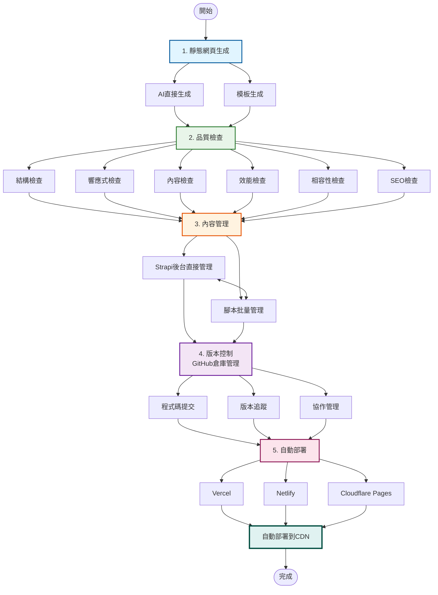
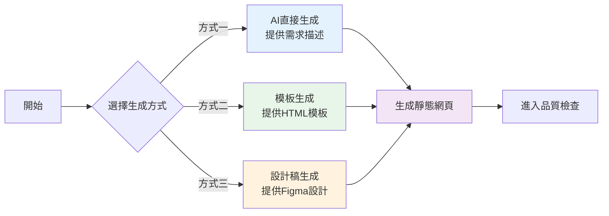
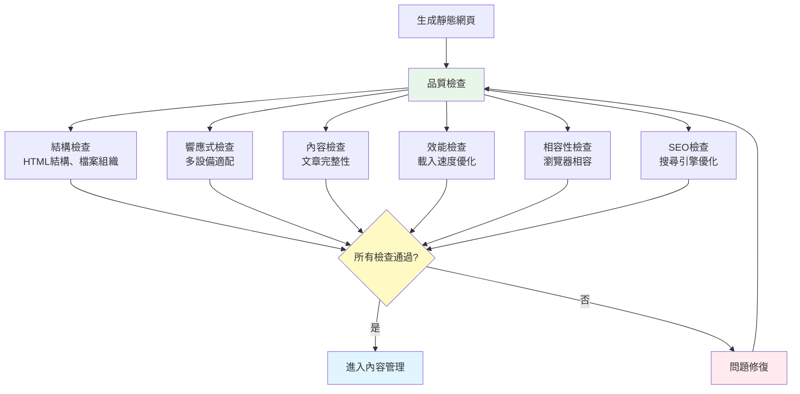
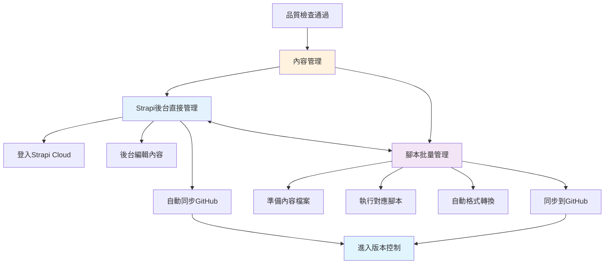
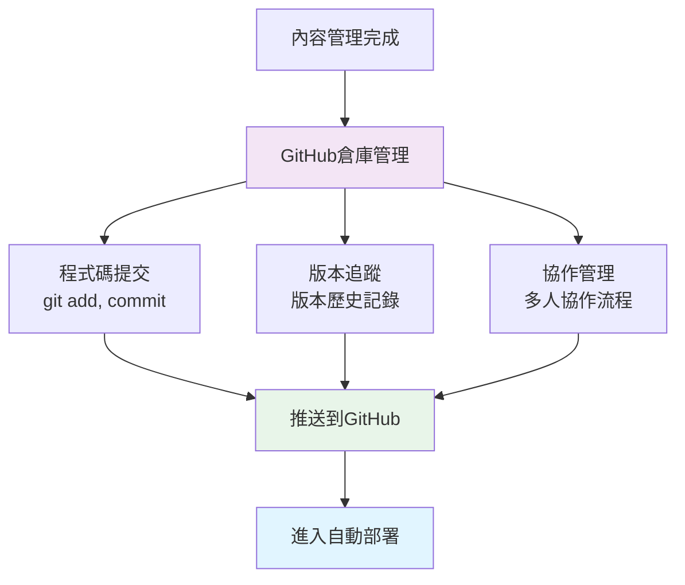
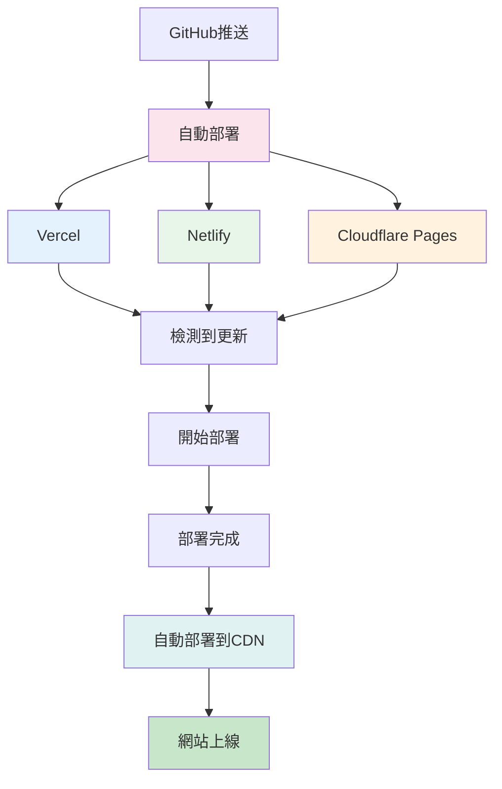
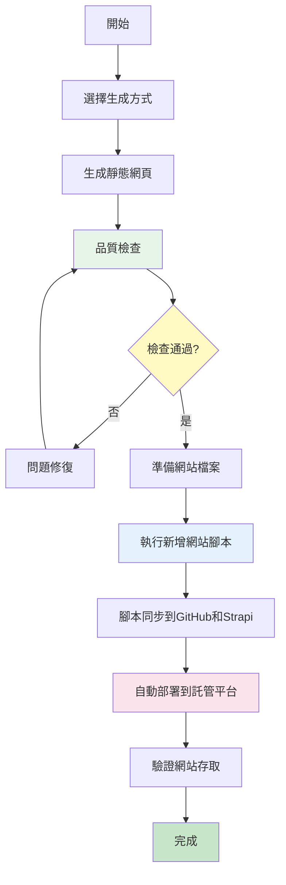
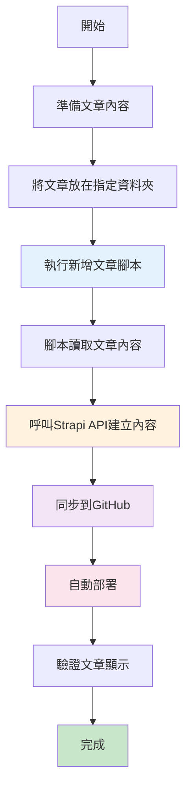
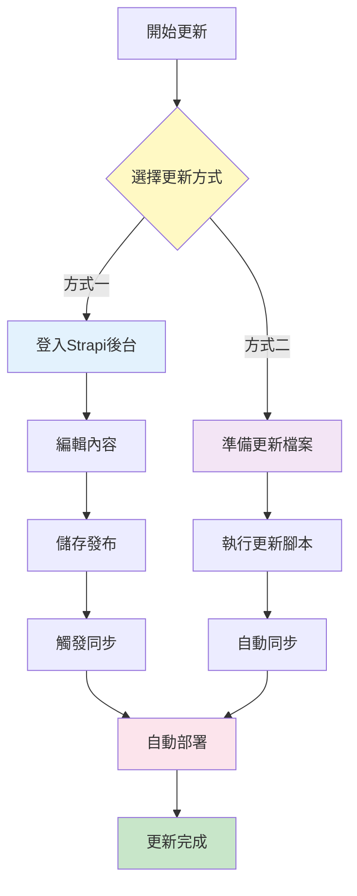

# 靜態網站生成與CMS管理系統 - 工作流程圖

## 完整工作流程

## 詳細流程圖（分階段）

### 階段一：靜態網頁生成

### 階段二：品質檢查

### 階段三：內容管理

### 階段四：版本控制

### 階段五：自動部署

## 新增網站流程

## 新增文章流程

## 內容更新流程

---

## 使用說明

### 如何查看這些流程圖

1. **在GitHub上查看**
   - 直接上傳到GitHub，GitHub會自動渲染Mermaid圖表

2. **在VS Code中查看**
   - 安裝 "Markdown Preview Mermaid Support" 擴充功能
   - 開啟預覽模式即可看到圖表

3. **線上查看**
   - 訪問 https://mermaid.live/
   - 複製Mermaid程式碼貼上即可查看和編輯

4. **匯出為圖片**
   - 在 https://mermaid.live/ 中匯出為PNG或SVG
   - 或使用其他Mermaid工具匯出

---

**備註：** 這些流程圖使用Mermaid語法編寫，可以在支援Mermaid的平台上直接渲染為視覺化圖表。

